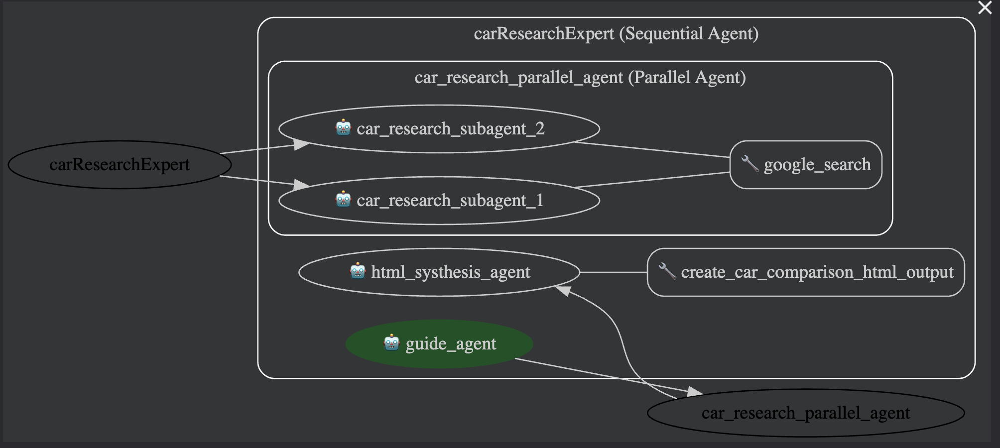

# 🚗 Car Research Expert — Agentic AI Workflow

The **Car Research Expert** is an agentic AI workflow that compares **two different cars** and generates a detailed **HTML comparison report** located at:

```
html/car_comparison.html
```

This project uses a multi-agent structure where each agent performs specific tasks in the workflow — from data processing, to reasoning, to generating the final output.

---

## 🧠 Workflow Overview

Below is the visual workflow (replace with your actual image link):



---

## 📂 Project Structure

> ⚠️ **Important:**
>
> * Each **agent folder name must match the agent name** in the workflow.
> * Inside each agent folder, the main script **must be named `agent.py`**.
> * **Do NOT change the folder structure**. The agentic runtime depends on this exact tree.

```
.
├── car_research_parallel_agent
│   ├── __init__.py
│   └── agent.py
├── car_researcher_1
│   ├── __init__.py
│   └── agent.py
├── car_researcher_2
│   ├── __init__.py
│   └── agent.py
├── carResearchExpert
│   ├── .env
│   ├── __init__.py
│   └── agent.py
├── guide_agent
│   ├── __init__.py
│   └── agent.py
├── html
│   └── car_comparison.html
├── html_systhesis_agent
│   ├── __init__.py
│   └── agent.py
├── requirements.txt
├── schema
│   ├── __init__.py
│   ├── car_comparison_schema.py
│   └── car_research_schema.py
├── templates
│   └── car_comparison_template.html
├── tools
│   ├── __init__.py
│   ├── car_comparison_tool.py
│   ├── fileSaver.py
│   └── htmlGenerator.py
└── workFlowImg
```

---

## 🔧 .env Configuration

Create a `.env` file inside the project root containing:

```
GOOGLE_GENAI_USE_VERTEXAI=FALSE
GOOGLE_API_KEY="Your-Google-AI-Studio_API-Key"
GEMINI_MODEL = "gemini-2.0-flash"
```

- `GOOGLE_API_KEY` — Get from [Google AI Studio](https://ai.google.com/studio). Keep it secret.

---

## ▶️ How to Run

Copy/paste your existing “How to Run” steps here — I’ve formatted a clean template for you:

### **1. Create & Activate Virtual Environment**

```bash
python -m venv venv
source venv/bin/activate   # MacOS/Linux
venv\Scripts\activate      # Windows
```

### **2. Install Dependencies**

```bash
pip install -r requirements.txt
```

### **3. Setup Environment Variables**

Make sure your `.env` file is correctly configured (see section above).

### **4. Run the Workflow**

```bash
> open Terminal
> go to the project root folder car_benchmark_agent
> Type the Command adk web
> Click on the link. It will look like this '127.0.0.1:8000' (your port number can be different). It will open a Tab in your Browser.
> On the left side, from the dropdown, select CarResearchExpert.
> Now, on the right side, Write your Prompt. For e.g., "compare Audi A3 vs BMW i3"
```

### **5. View Output**

Generated HTML report will be available at:

```
html/car_comparison.html
```

---

## 🛠️ Technologies Used

* **Python 3.10+**
* **Agentic Workflow Architecture**
* **Google Agent Development Kit**
* **Gemini-2.0-flash Model**

